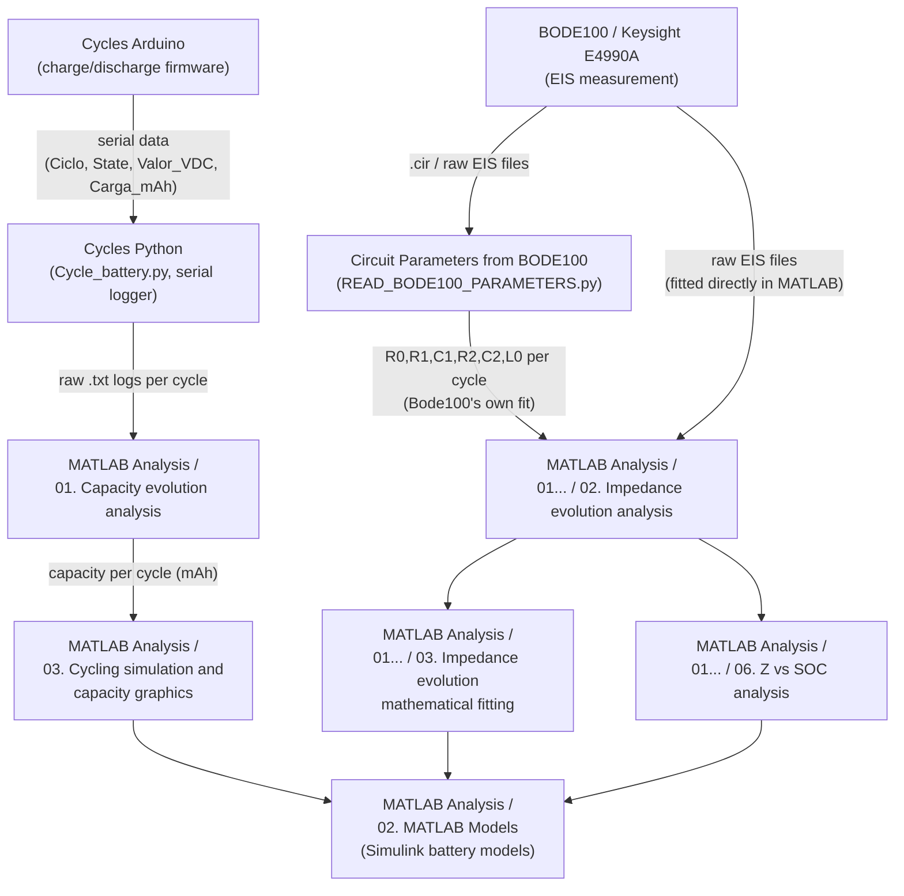

# Battery Degradation TFG — Code

Code used in my Bachelor's Thesis (TFG) to characterize and model the degradation of a
lithium-ion battery through cycling, electrochemical impedance spectroscopy (EIS) and
equivalent-circuit fitting.

## Data pipeline

The project has three physical stages (data acquisition → circuit-parameter extraction →
degradation modelling), covered by four top-level folders:



In short: the Arduino boards cycle the battery and stream data over serial; the Python
script on the PC logs that stream to `.txt` files; MATLAB extracts capacity per cycle from
those logs. In parallel, an impedance analyzer (Bode 100 / Keysight E4990A) measures EIS
per cycle. The equivalent-circuit parameters (R0, L0, R1‑C1, R2‑C2) come from two sources
that both land in `02. Impedance evolution analysis`: the Bode 100's own fit (parsed from
its raw export by the Python script) and MATLAB's own least-squares fit run directly on the
raw EIS data. From there, the parameter trends are further analyzed (mathematical fitting,
Z vs SOC), and — together with the capacity evolution — feed the Simulink battery model and
the capacity-loss optimization.

## Folder structure

```
Codes/
├── Cycles Arduino/                        Firmware for charge/discharge/OCV-SOC cycling
│   ├── 01. Simple Cycling/                Single charge or discharge routines (CC / CC-CV)
│   ├── 02. Continuous Cycling/            Repeated charge+discharge cycles, unattended
│   ├── 03. Temperature Testing/           Temperature logging during cycling (OneWire probe)
│   └── 04. OCV-SOC Cycling/               Very slow (C/30) cycling to build the OCV-SOC curve
│
├── Cycles Python/                         PC-side serial logger (talks to the Arduino boards)
│   ├── Cycle_battery.py
│   └── requirements.txt
│
├── Circuit Parameters from BODE100/       Parses raw EIS exports into per-cycle R/C/L tables
│   └── READ_BODE100_PARAMETERS.py
│
└── MATLAB Analysis/
    ├── 01. Battery degradation Codes for Analysis/
    │   ├── 01. Capacity evolution analysis/       Extracts capacity per cycle from serial logs
    │   ├── 02. Impedance evolution analysis/      Equivalent-circuit fitting (LM, weighted LM,
    │   │                                          GA/DE/PSO) + Bode100-vs-MATLAB comparisons
    │   ├── 03. Impedance evolution mathematical fitting/  Trend curves for each circuit
    │   │                                          parameter (exponential, power, Gompertz,
    │   │                                          Weibull, gaussian, spline, polyfit)
    │   ├── 04. Plot OCV-SOC/                      OCV vs SOC curve from the slow-cycling data
    │   ├── 05. Plot_nyquist/                      Quick raw-data Nyquist plotting utilities
    │   └── 06. Z vs SOC analysis/                 Impedance parameters vs State of Charge
    │
    ├── 02. MATLAB Models/                 Simulink battery models (2D and 3D lookup tables)
    │
    └── 03. Cycling simulation and capacity graphics/
                                            Battery model simulation + capacity-loss parameter
                                            optimization (fminsearch) against experimental data
```

## Requirements

**MATLAB**
- Tested with MATLAB R2026a 
- **Optimization Toolbox** — required for `lsqcurvefit`, `fminsearch`, `optimoptions`
- **Global Optimization Toolbox** — required for `ga` and `particleswarm` (used in the
  GA/PSO equivalent-circuit fitting scripts)
- `.mlx` files require MATLAB Live Editor (included by default since R2016a)

**Arduino**
- Arduino IDE (any recent 1.8.x / 2.x release)
- Libraries (install via Library Manager):
  - `OneWire` (temperature probe, used in `03. Temperature Testing`)
  - `PIDController` (charge/discharge control loop)

**Python**
- Python 3.x
- Install dependencies with:
  ```bash
  pip install -r "Cycles Python/requirements.txt"
  ```
  (Only external dependency: `pyserial`, used by `Cycle_battery.py` to talk to the Arduino
  over the serial port. `Circuit Parameters from BODE100/READ_BODE100_PARAMETERS.py` only
  uses the standard library.)

## Before running anything

Several MATLAB scripts read/write files using placeholder paths of the form:

```matlab
ruta_archivo = 'C:\your_route\your_file.xlsx';
```

**Replace these with your own paths** before running — they were generalized on purpose so
this repo doesn't leak a personal folder structure. Search for `your_route` across the repo
to find every one of them.
